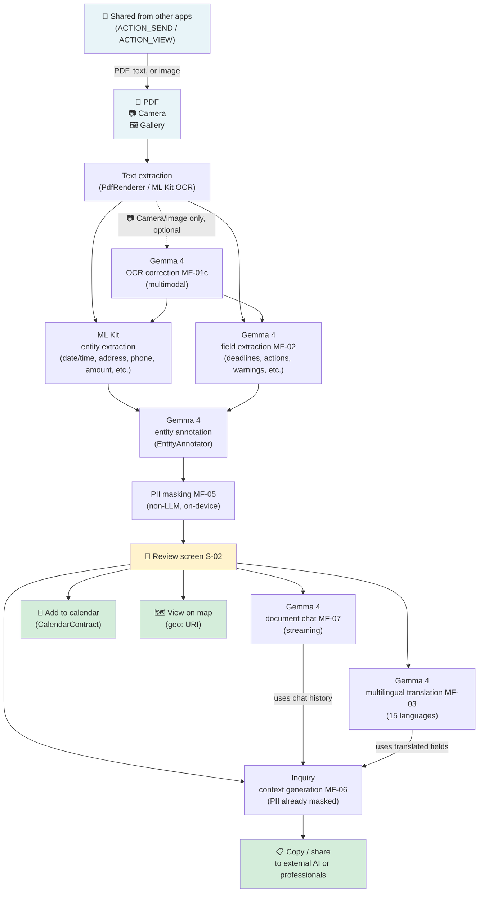

# Paperwork Navigator

[](LICENSE)
[]()
[]()
[]()
[]()

**A privacy-first document navigator for anyone who receives paperwork written in a language that is not their native one.**
It reads, analyzes, and translates documents entirely on-device, then generates consultation context with PII masked for experts or external AI tools. **No personal information ever leaves the device.**

> This project is forked from Google AI Edge Gallery and adds a custom Document Review task.

---

## The Problem

Millions of people around the world, including immigrants, international students, expatriates, and refugees, **receive administrative, medical, and everyday documents written in languages other than their native one.**

- Deadlines, required documents, and penalties are written in a foreign language, making it unclear what action is required.
- Copying a document into an online translation service can send **sensitive information such as names, addresses, and ID numbers to external servers**.
- Even if the text is translated, it is still difficult to understand the urgency, deadlines, and required actions.
- Asking an expert or an AI system for help is risky when the original document contains personal information.

---

## The Solution

Paperwork Navigator removes that tradeoff by completing the full inference flow on-device.

| Step | Description |
|------|-------------|
| 1. Import a document | Open a document from PDF, camera, gallery, or Android sharing intents |
| 2. Read and structure it on-device | After text extraction, Gemma 4 and ML Kit organize deadlines, required actions, warnings, and more entirely on-device |
| 3. Review and understand it | Use the review screen, optional translation into 15 languages, and document chat to understand the content |
| 4. Mask and consult safely | Generate PII-masked inquiry context that can be shared with external AI tools or professionals |

---

## Screenshots

<!-- TODO: Add real device screenshots here -->
<!-- Example:  -->
<!-- Example:  -->
<!-- Example:  -->
<!-- Example:  -->

> Screenshots will be added later.

---

## Processing Pipeline



**After the initial model download, all AI inference runs entirely on-device.** External transmission occurs only when downloading the model for the first time, or when the user explicitly chooses to share generated content.

---

## Main Features

| ID | Feature | Details |
|----|---------|---------|
| MF-01 | Text extraction | Supports text PDFs, text files, camera capture, and gallery images with OCR for 12 languages. Can also launch directly via Android `ACTION_SEND` / `ACTION_VIEW` |
| MF-01c | OCR correction | After camera or image input, Gemma 4 multimodal inference compares the original image with OCR output and corrects recognition errors as an optional step |
| MF-02 | Structured field extraction | 1) ML Kit Entity Extraction identifies dates, addresses, phone numbers, amounts, and more, 2) Gemma 4 (EntityAnnotator) adds contextual labels such as submission deadline, issuer address, or date of birth, and 3) Gemma 4 field extraction derives deadlines, actions, and warnings |
| MF-03 | Multilingual translation | Supports 15 languages with original and translated text displayed side by side |
| MF-04 | Review screen | Shows deadlines, required documents, and warnings with category color badges. Includes quick actions for adding deadlines to the calendar via `CalendarContract` and opening issuer addresses in maps via `geo:` URI |
| MF-05 | PII masking | Does not use an LLM. Uses extracted entities and rule-based masking, with per-span user control |
| MF-06 | Inquiry context generation | Builds consultation context in a wizard-style flow. Produces PII-masked text for sharing with external AI tools or professionals |
| MF-07 | Document understanding chat | Passes the ReviewResult to Gemma 4 as context and answers document-specific questions entirely on-device |

---

## Privacy Design

```text
Tier 1 (never leaves the device): names, addresses, dates of birth, My Number, bank account numbers
Tier 2 (can be shared externally with user consent): issuer contact info, deadlines, amounts in masked form
Tier 3 (no PII): document titles, urgency flags, translated text
```

- **On-device inference**: All Gemma 4 inference runs locally through LiteRT-LM
- **Minimal permissions**: Does not request read/write access to external storage
- **User consent**: Sending masked consultation context is always initiated by the user through the Android share sheet
- **Transparency**: The UI clearly shows which categories were masked

For details, see [docs/privacy-spec.md](docs/privacy-spec.md).

---

## Tech Stack

| Component | Technology |
|-----------|------------|
| LLM runtime | LiteRT-LM |
| Model | Gemma 4 E2B / E4B |
| UI | Jetpack Compose |
| DI | Hilt |
| PDF text extraction | Android PdfRenderer (API 35) |
| OCR (image and camera) | ML Kit Text Recognition |
| OCR correction | Gemma 4 multimodal inference (MF-01c) |
| Entity extraction | ML Kit Entity Extraction + Gemma 4 |
| Entity annotation | Gemma 4 |
| Language identification | ML Kit Language Identification |
| Camera scanning | ML Kit Document Scanner |
| Camera preview | CameraX |
| State management | ViewModel + StateFlow |

---

## Validation Environment

- Min SDK: 35 (Android 15)
- Google Pixel 9

---

## Documentation

| File | Contents |
|------|----------|
| [docs/implementation-spec.md](docs/implementation-spec.md) | Implementation spec: screen design, data models, and processing flows |
| [docs/prompt-spec.md](docs/prompt-spec.md) | Full LLM prompts for MF-02, MF-03, MF-06, and MF-07 |
| [docs/extraction-architecture-spec.md](docs/extraction-architecture-spec.md) | Entity extraction and PII tiering design using ML Kit + Gemma 4 |
| [docs/privacy-spec.md](docs/privacy-spec.md) | PII classification and data lifecycle |
| [docs/test-spec.md](docs/test-spec.md) | Test specifications |

---

## License

Apache License 2.0. See [LICENSE](LICENSE) for details.
