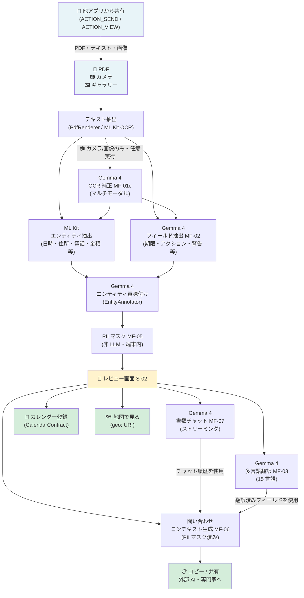

# Paperwork Navigator

[](LICENSE)
[]()
[]()
[]()
[]()
[](https://github.com/joyk0117/Paperwork-Navigator/releases/latest)

> **[最新APKをダウンロード](https://github.com/joyk0117/Paperwork-Navigator/releases/latest/download/app-debug.apk)**

**母語以外の言語で書かれた書類を受け取ったすべての人のための、プライバシーファーストな書類ナビゲーター。**
受け取った書類を端末上だけで読み取り・解析・翻訳し、PII をマスクしたうえで専門家や外部 AI への相談コンテキストを生成します。**個人情報は一切端末の外に出ません。**

> Google AI Edge Gallery をベースにフォークし、Document Review タスクを追加実装しています。

---

## 解決する問題

海外移住者・留学生・駐在員・難民など、**母語以外の言語で書かれた行政・医療・生活書類を受け取る人は世界中に何百万人もいます。**

- 期限・必要書類・罰則が外国語で書かれており、何をすべきかが分からない
- オンライン翻訳サービスに書類を貼り付けると、**氏名・住所・ID 番号など機密情報が外部サーバーに送信されてしまう**
- 翻訳できたとしても、書類の重要度・締め切り・必要アクションを整理して理解するのは難しい
- 専門家や AI に相談するにも、個人情報を含む書類をそのまま渡すのはリスクがある

---

## ソリューション

Paperwork Navigator はすべての推論を端末内で完結させることで、このトレードオフを解消します。

| ステップ | 説明 |
|---------|------|
| 1. 書類を取り込む | PDF・カメラ・ギャラリー・他アプリ共有から書類を開く |
| 2. 端末内で読み取って整理する | テキスト抽出後、Gemma 4 と ML Kit が期限・必要アクション・警告などを端末内で整理する |
| 3. レビューしながら理解する | レビュー画面で内容を確認し、必要に応じて 15 言語翻訳や書類チャットを使う |
| 4. マスクして安全に相談する | PII をマスクした問い合わせコンテキストを生成し、外部 AI や専門家に共有する |

---

## スクリーンショット

<!-- TODO: 実機スクリーンショットをここに追加 -->
<!-- 例:  -->
<!-- 例:  -->
<!-- 例:  -->
<!-- 例:  -->

> スクリーンショット追加予定

---

## 処理パイプライン



**初回ダウンロード以降は、AI推論処理はすべて端末内で完結します。** 外部送信が発生するのは、モデルの初回ダウンロード時と、ユーザーが共有を明示的に実行した場合だけです。

---

## 主な機能

| ID | 機能 | 詳細 |
|----|------|------|
| MF-01 | テキスト抽出 | テキスト PDF・テキストファイル・カメラ撮影・ギャラリー画像（12 言語 OCR 対応）。他アプリからの `ACTION_SEND` / `ACTION_VIEW` でも直接起動可 |
| MF-01c | OCR 補正 | カメラ/画像入力後、Gemma 4 マルチモーダル推論で元画像と OCR テキストを照合し誤認識を修正（任意実行） |
| MF-02 | 構造化フィールド抽出 | ① ML Kit Entity Extraction で日時・住所・電話・金額などを抽出、② Gemma 4 (EntityAnnotator) が「提出期限」「発行者住所」「生年月日」など文脈ラベルを付与、③ Gemma 4 フィールド抽出で期限・アクション・警告を取得 |
| MF-03 | 多言語翻訳 | 15 言語対応。原文・翻訳を2列並列表示 |
| MF-04 | レビュー画面 | 期限・必要書類・警告をカテゴリ別にカラーバッジで表示。期限をカレンダーに追加（`CalendarContract`）・発行元住所を地図で表示（`geo:` URI）のクイックアクションを提供 |
| MF-05 | PII マスク | LLM 不使用。抽出済みエンティティをルールベースでマスク。ユーザーがスパン単位でオン/オフ可能 |
| MF-06 | 問い合わせコンテキスト生成 | ウィザード形式でコンテキストを組み立て。PII マスク済みのテキストを生成し外部 AI・専門家への共有を補助 |
| MF-07 | 書類理解チャット | ReviewResult をコンテキストとして Gemma 4 に渡し、書類に関する Q&A をオンデバイスで実行 |

---

## プライバシー設計

```
Tier 1（端末外に出さない）  氏名・住所・生年月日・マイナンバー・口座番号
Tier 2（ユーザー同意のもと外部出力可）  発行者連絡先・期限・金額（マスク済み形式）
Tier 3（PII なし）  書類タイトル・重要度フラグ・翻訳テキスト
```

- **オンデバイス推論**: すべての Gemma 4 推論は LiteRT-LM で端末内完結
- **最小権限**: 外部ストレージの読み書き権限は要求しない
- **ユーザー同意**: マスク済みコンテキストの送信は Android 共有シートを通じてユーザー自身が行う
- **透明性**: マスクしたフィールドのカテゴリを UI で明示

詳細は [docs/privacy-spec_ja.md](docs/privacy-spec_ja.md) を参照。

---

## 技術スタック

| 要素 | 採用技術 |
|------|---------|
| LLM ランタイム | LiteRT-LM |
| モデル | Gemma 4 E2B / E4B |
| UI | Jetpack Compose |
| DI | Hilt |
| PDF テキスト抽出 | Android 標準 PdfRenderer (API 35) |
| OCR（画像・カメラ） | ML Kit Text Recognition |
| OCR 補正 | Gemma 4 マルチモーダル推論（MF-01c） |
| エンティティ抽出 | ML Kit Entity Extraction + Gemma 4 |
| エンティティ注釈 | Gemma 4 |
| 言語識別 | ML Kit Language Identification |
| カメラスキャン | ML Kit Document Scanner |
| カメラプレビュー | CameraX |
| 状態管理 | ViewModel + StateFlow |

---

## 検証環境

- Min SDK: 35（Android 15）
- Google Pixel 9

---

## ドキュメント

| ファイル | 内容 |
|---------|------|
| [docs/implementation-spec_ja.md](docs/implementation-spec_ja.md) | 実装仕様（画面設計・データモデル・処理フロー） |
| [docs/prompt-spec_ja.md](docs/prompt-spec_ja.md) | LLM プロンプト全文（MF-02/03/06/07） |
| [docs/extraction-architecture-spec_ja.md](docs/extraction-architecture-spec_ja.md) | ML Kit + Gemma 4 によるエンティティ抽出・PII Tier 分類の設計 |
| [docs/privacy-spec_ja.md](docs/privacy-spec_ja.md) | PII 分類・データライフサイクル |
| [docs/test-spec_ja.md](docs/test-spec_ja.md) | テスト仕様 |

---

## ライセンス

Apache License 2.0。詳細は [LICENSE](LICENSE) を参照。
